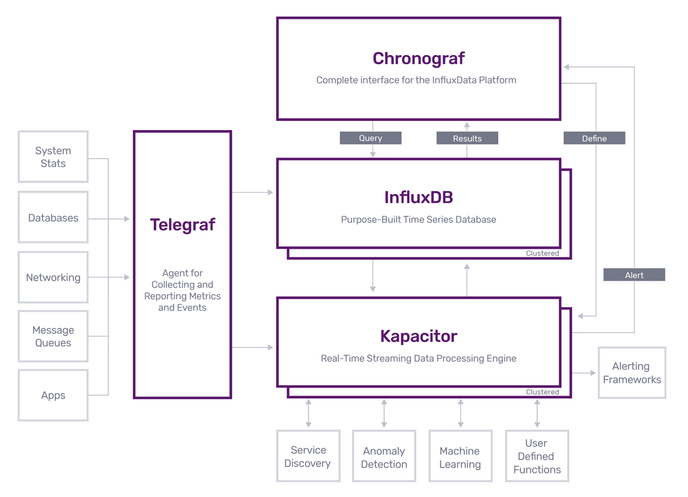
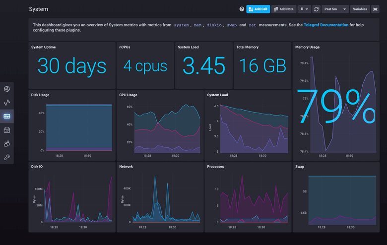

# TICK Stack Dashboard 

> Building  a dashboard using the TICK Stack 

* Telegraf
* InfluxDB
* Chronograf
* Kapacitor 

Arch: 







Getting Started : 

---
### Default Ports: 

* Telegraf `does not expose ports by default. It will not expose ports unless you have a service plugin enabled`
* InfluxDB `:8086`
* Chronograf `:8888`
* Kapacitor `:9092`

```bash
Telegraf can also collect metrics via the following service plugins:

CPU, DISk, MEM (Default Example)
http_listener
kafka_consumer
mqtt_consumer
nats_consumer
nsq_consumer
logparser
statsd
socket_listener
tail
tcp_listener
udp_listener
webhooks
- filestack
- github
- mandrill
- rollbar
```

### Docker Images: 

* Telegraf `docker pull telegraf`
* InfluxDB `docker pull influxdb`
* Chronograf `docker pull quay.io/influxdb/chronograf:1.8.6`
* Kapacitor `docker pull kapacitor`

---
### Using Docker :

*easaier setup than downloading*

```bash
# Make sure Docker installed 
cd Docker
docker-compose build # First time only, it will pull the images and build the containers from the images.
docker-compose up #if not built, it will auto-build first then run the containers.
```

---

### Downloading :
Download Telegraf v1.15.2: 

Mac (Homebrew): 
```bash
brew update
brew install telegraf
```


Ubuntu : 
```bash
wget https://dl.influxdata.com/telegraf/releases/telegraf_1.15.3-1_amd64.deb
sudo dpkg -i telegraf_1.15.3-1_amd64.deb
```

Windows 64: 
```bash
wget https://dl.influxdata.com/telegraf/releases/telegraf-1.15.3_windows_amd64.zip
unzip telegraf-1.15.3_windows_amd64.zip
```

Linux Binaries 64
```bash
wget https://dl.influxdata.com/telegraf/releases/telegraf-1.15.3_linux_amd64.tar.gz
tar xf telegraf-1.15.3_linux_amd64.tar.gz
```
before starting telegraf on windows add to the system variables where telegraf is installes, then
start Telegraf : 

```bash
telegraf
```

---
Download InfluxDB v1.8.2: 

Mac (Homebrew): 
```bash
brew update
brew install influxdb
```

Mac OS X: 
```bash
https://dl.influxdata.com/influxdb/releases/influxdb-1.8.2_darwin_amd64.tar.gz
tar zxvf influxdb-1.8.2_darwin_amd64.tar.gz
```

Ubuntu : 
```bash
wget https://dl.influxdata.com/influxdb/releases/influxdb_1.8.2_amd64.deb
sudo dpkg -i influxdb_1.8.2_amd64.deb
```

Windows 64: 
```bash
https://dl.influxdata.com/influxdb/releases/influxdb-1.8.2_windows_amd64.zip
unzip influxdb-1.8.2_windows_amd64.zip
```

Linux Binaries 64
```bash
wget https://dl.influxdata.com/influxdb/releases/influxdb-1.8.2_linux_amd64.tar.gz
tar xvfz influxdb-1.8.2_linux_amd64.tar.gz
```
before starting InfluxDB on windows add to the system variables where InfluxDB is installes, then
start InfluxDB : 

```bash
influxd #will start the service for influx
```


---
Download Chronograf v1.8.6: 

Mac (Homebrew): 
```bash
brew update
brew install chronograf
```

Mac OS X: 
```bash
https://dl.influxdata.com/chronograf/releases/chronograf-1.8.6_darwin_amd64.tar.gz
tar zxvf chronograf-1.8.6_darwin_amd64.tar.gz
```

Ubuntu : 
```bash
wget https://dl.influxdata.com/chronograf/releases/chronograf_1.8.6_amd64.deb
sudo dpkg -i chronograf_1.8.6_amd64.deb
```

Windows 64: 
```bash
https://dl.influxdata.com/chronograf/releases/chronograf-1.8.6_windows_amd64.zip
unzip chronograf-1.8.6_windows_amd64.zip
```

Linux Binaries 64
```bash
wget https://dl.influxdata.com/chronograf/releases/chronograf-1.8.6_linux_amd64.tar.gz
tar xvfz chronograf-1.8.6_linux_amd64.tar.gz
```
before starting Chronograf on windows add to the system variables where Chronograf is installes, then
start Chronograf : 

```bash
chronograf 
```


---
Download Kapacitor v1.5.6: 

Mac (Homebrew): 
```bash
brew update
brew install kapacitor
```

Ubuntu : 
```bash
wget https://dl.influxdata.com/kapacitor/releases/kapacitor_1.5.6-1_amd64.deb
sudo dpkg -i kapacitor_1.5.6-1_amd64.deb
```

Windows 64: 
```bash
wget https://dl.influxdata.com/kapacitor/releases/kapacitor-1.5.6_windows_amd64.zip -UseBasicParsing -OutFile kapacitor-1.5.6_windows_amd64.zip
Expand-Archive  .\kapacitor-1.5.6_windows_amd64.zip -DestinationPath 'C:\Program Files\kapacitor\'
```

Linux Binaries 64
```bash
https://dl.influxdata.com/kapacitor/releases/kapacitor-1.5.6_windows_amd64.zip
```
before starting Kapacitor on windows add to the system variables where Kapacitor is installes, then
start Kapacitor : 

```bash
Kapacitord # will start the Kapacitor Service 
```


### To Start : 

*if setup, and PATH configured*, in seperate terminals run the commands

```bash
influxd
# then
telegraf
# then 
influx
# then 
Chronograf
# then 
Kapacitord
```


in the `influx`terminal, run `SHOW DATABASES`, `USE telegraf`, `SHOW MEASUREMENTS`, `SHOW QUERIES`, `SHOW SHARDS`

- Example : 

`SHOW FIELD KEYS` :

```bash
name: win_cpu
fieldKey                fieldType
--------                ---------
Percent_DPC_Time        float
Percent_Idle_Time       float
Percent_Interrupt_Time  float
Percent_Privileged_Time float
Percent_Processor_Time  float
Percent_User_Time       float

name: win_disk
fieldKey                  fieldType
--------                  ---------
Current_Disk_Queue_Length float
Free_Megabytes            float
Percent_Disk_Read_Time    float
Percent_Disk_Time         float
Percent_Disk_Write_Time   float
Percent_Free_Space        float
Percent_Idle_Time         float

name: win_diskio
fieldKey                  fieldType
--------                  ---------
Current_Disk_Queue_Length float
Disk_Read_Bytes_persec    float
Disk_Reads_persec         float
Disk_Write_Bytes_persec   float
Disk_Writes_persec        float
Percent_Disk_Read_Time    float
Percent_Disk_Time         float
Percent_Disk_Write_Time   float

name: win_mem
fieldKey                            fieldType
--------                            ---------
Available_Bytes                     float
Cache_Faults_persec                 float
Demand_Zero_Faults_persec           float
Page_Faults_persec                  float
Pages_persec                        float
Pool_Nonpaged_Bytes                 float
Pool_Paged_Bytes                    float
Standby_Cache_Core_Bytes            float
Standby_Cache_Normal_Priority_Bytes float
Standby_Cache_Reserve_Bytes         float
Transition_Faults_persec            float

name: win_net
fieldKey                   fieldType
--------                   ---------
Bytes_Received_persec      float
Bytes_Sent_persec          float
Packets_Outbound_Discarded float
Packets_Outbound_Errors    float
Packets_Received_Discarded float
Packets_Received_Errors    float
Packets_Received_persec    float
Packets_Sent_persec        float

name: win_swap
fieldKey      fieldType
--------      ---------
Percent_Usage float

name: win_system
fieldKey                fieldType
--------                ---------
Context_Switches_persec float
Processor_Queue_Length  float
System_Calls_persec     float
System_Up_Time          float
```

Query : 

```SQL
SELECT Percent_Idle_Time FROM win_cpu LIMIT 10

SELECT Available_Bytes  FROM win_mem LIMIT 10
```

```bash
>  SELECT Percent_Idle_Time FROM win_cpu LIMIT 10
name: win_cpu
time                Percent_Idle_Time
----                -----------------
1599997804000000000 88.06343078613281
1599997804000000000 89.12462615966797
1599997804000000000 88.06210327148438
1599997804000000000 91.40750885009766
1599997804000000000 88.96546173095703
1599997810000000000 88.12652587890625
1599997810000000000 84.52249145507812
1599997810000000000 85.84213256835938
1599997810000000000 84.53411865234375
1599997810000000000 86.1854019165039
> SELECT Available_Bytes  FROM win_mem LIMIT 10
name: win_mem
time                Available_Bytes
----                ---------------
1599997804000000000 412909568
1599997810000000000 376549376
1599997820000000000 365977600
1599997830000000000 337690624
1599997841000000000 653959168
1599997850000000000 653037568
1599997860000000000 595034112
1599997870000000000 590839808
1599997880000000000 596590592
1599997890000000000 568860672
```

```SQL
SELECT mean("Available_Bytes") AS "available_bytes" FROM "telegraf"."autogen"."win_mem" WHERE time > 1599997804000000000
```


- to view the dashboards : 

in the browser visit `localhost:8888`

`username:user`, `password:pass`


### TO DO 

- will try different data sources [NATs, Kafka, StatsD, SalesForce, Webhooks, OpenSMTPD, Kibana ...etc, Check more input plugins for Telegraf](https://docs.influxdata.com/telegraf/v1.15/plugins/)
- Build different Dashboards for Different sources, [Check other pre-built dashboards](https://docs.influxdata.com/chronograf/v1.8/guides/using-precreated-dashboards/)
- and different [DataViz types](https://docs.influxdata.com/influxdb/v2.0/visualize-data/visualization-types/)
- will add a clustered Kapacitor and InfluxDB using Docker Swarm in `./Docker/Cluster`
- will add a clustered Kapacitor and InfluxDB using Kubernetes in `./Docker/Kubernetes`
- will try and add Garafana ~~and Prometheus~~
- will try and Build a Vue app to show the Dashboard elements


### References 

Download [References](https://portal.influxdata.com/downloads/)
